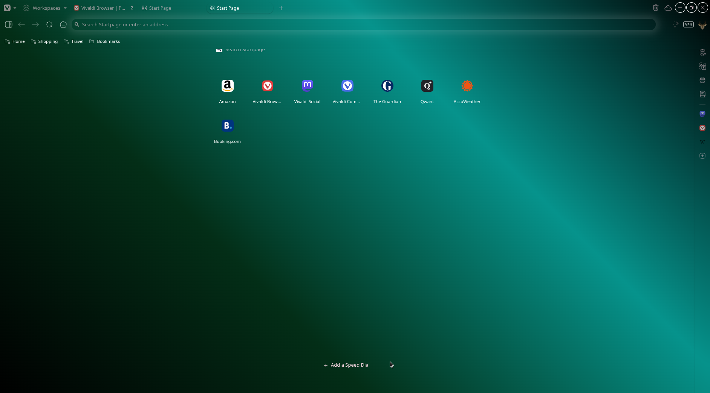

# VivaZen THEME

## A Zen-like Experience for Vivaldi

- Auto-hide tab bar, address bar, and bookmarks with many customization options
- Works with tab bar positioned anywhere (left, right, top, or bottom)
- Compatible with bookmarks on top or bottom and web panels on right or left

## ⚠️ IMPORTANT ⚠️

**Window dragging does not work** - This CSS mod disables the ability to drag the browser window by the toolbar or tab bar due to the required `-webkit-app-region: none` property. You can only drag the window using the window title bar.

## Video/Screenshots


### Color as background



## How to use it?

1. Go to **vivaldi://experiments** and enable **Allow CSS modification**
2. Download _VivaZen.css_ and put it in a new folder
3. In settings, go to **Appearance**, find **Custom UI Modifications**, and select the folder with _VivaZen.css_
4. You can use color or image or gif as background
5. Reboot the browser

## Your changes

### REMOVE STYLING FOR ELEMENTS

If you don't want any changes in themes only auto hide remove code under

```css
    /* ========================================== */
    /* ========== STYLING FOR ELEMENTS ========== */
    /* ========================================== */

    ...
```

Where also you can delete **START PAGE BACKGRoUND**, **PAGE TRANSITIONS** and **WINDOW CONTROLS**

### Change background

1. Paste your picture in **vivaldi/Default/VivaldiThumbnails/**
2. In **`VivaZen.css`**:
   - Uncomment the following line of code:

     ```css
     /* --background: url("chrome://vivaldi-data/thumbnail/YourIconName"); */
     ```

3. Save, reboot browser and have fun!

### Reader View

If you want the Reader View button on the address bar, remove this code from _VivaZen.css_:

```css
/* Remove reader view */
.button-toolbar:has(button.ToolbarButton-Button[aria-label="Reader View"]) {
  display: none;
}
```
